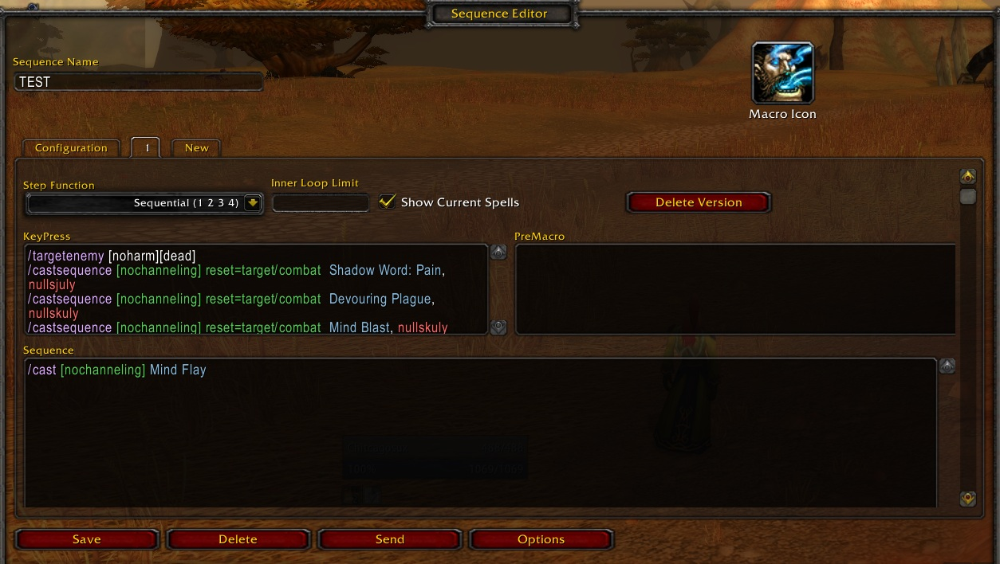

# GSE2-Wotlk-3.3.5

My effot to get GSE 2.6.54 working on 3.3.5 client

My testing is being done on Stormforge-Frostmourne server.

You canh use the GUI to create your macro or inport/export, here is a macro you can import as an example.


If you aren't a Priest you probably want to change the spells and change `SpecID: 5` to the class you want to use the macro on. 

```
[1] = "Warrior"
[2] = "Paladin"
[3] = "Hunter"
[4] = "Rogue"
[5] = "Priest"
[6] = "DeathKnight"
[7] = "Shaman"
[8] = "Mage"
[9] = "Warlock"
```

`Import this:`
  ```
GSE Simple Export: TEST
Author: Chitcagosux@Frostmourne
SpecID: 5
Talents: 
TOC: 30300

=== Version 1 ===
KeyPress:
 /targetenemy [noharm][dead]
 /castsequence [nochanneling] reset=target/combat  Shadow Word: Pain, nulloo
 /castsequence [nochanneling] reset=target/combat  Devouring Plague, nulloo
 /castsequence [nochanneling] reset=target/combat  Mind Blast, nullskuly
Sequence:
 /cast [nochanneling] Mind Flay
```
`This is a screenshot of the macro after it's Imported`
